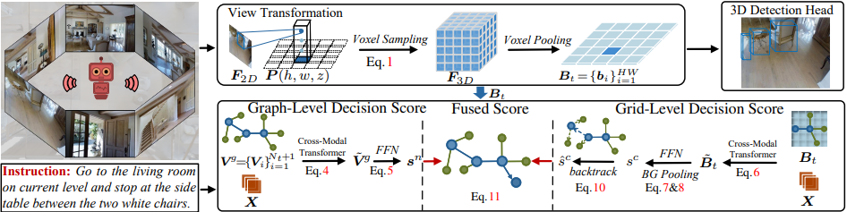

# Bird’s-Eye-View Scene Graph for Vision-Language Navigation



> This repository is an official PyTorch implementation of paper:<br>
> [Bird’s-Eye-View Scene Graph for Vision-Language Navigation](https://arxiv.org/abs/2308.04758).<br>
> ICCV 2023. ([arXiv 2308.04758](https://arxiv.org/abs/2308.04758))


## Abstract
Vision-language navigation (VLN), which entails an agent to navigate 3D environments following human instructions, has shown great advances. However, current agents are built upon panoramic observations, which hinders their ability to perceive 3D scene geometry and easily leads to ambiguous selection of panoramic view. To address these limitations, we present a BEV Scene Graph (BSG), which leverages multi-step BEV representations to encode scene layouts and geometric cues of indoor environment under the supervision of 3D detection. During navigation, BSG builds a local BEV representation at each step and maintains a BEV-based global scene map, which stores and organizes all the online collected local BEV representations according to their topological relations. Based on BSG, the agent predicts a local BEV grid-level decision score and a global graph-level decision score, combined with a sub-view selection score on panoramic views, for more accurate action prediction. Our approach significantly outperforms state-of-the-art methods on REVERIE, R2R, and R4R, showing the potential of BEV perception in VLN.

## Installation
The implementation of BEV Detection is built on [MMDetection3D v0.17.1](https://github.com/open-mmlab/mmdetection3d). Please follow [BEVFormer](https://github.com/fundamentalvision/BEVFormer) for installation. 

The implementation of VLN is built on the latest version of [Matterport3D simulators](https://github.com/peteanderson80/Matterport3DSimulator):
```
export PYTHONPATH=Matterport3DSimulator/build:$PYTHONPATH
```

Many thanks to the contributors for their great efforts.

## Dataset Preparation
The dataset is based on indoor RGB images from [Matterport3D](https://niessner.github.io/Matterport/). Please fill and sign the [Terms of Use](http://kaldir.vc.in.tum.de/matterport/MP_TOS.pdf) agreement form and send it to matterport3d@googlegroups.com to request access to the dataset. 

Note that we use the undistorted_color_images for BEV Detection. Camera parameters (word-to-pixel matrix) are from undistorted_camera_parameters. The 3D box annotations can be available in mp3dbev/data. For VLN, please follow [VLN-DUET](https://github.com/cshizhe/VLN-DUET) for more details, including processed annotations, features and pretrained models of REVERIE, R2R and R4R datasets.


## Extracting Features
Please follow the [scripts](https://github.com/cshizhe/VLN-HAMT/tree/main/preprocess) to extract visual features for both undistorted_color_images (for BEV Detection) and matterport_skybox_images (for VLN, optional). Note that all the ViT features of undistorted_color_images should be used (not only the [CLS] token, about 130 GB). Please note this line since different version of [timm](https://github.com/huggingface/pytorch-image-models) models have different output: 
```
b_fts = model.forward_features(images[k: k+args.batch_size])
```

## BEV Detection
```shell
cd mp3dbev/
# multi-gpu train
CUDA_VISIBLE_DEVICES=0,1,2,3 PORT=${PORT:id} ./tools/dist_train.sh ./projects/configs/bevformer/mp3dbev.py 4

# multi-gpu test
CUDA_VISIBLE_DEVICES=0,1,2,3 PORT=${PORT:id} ./tools/dist_test.sh ./projects/configs/bevformer/mp3dbev.py ./path/to/ckpts.pth 4

# inference for BEV features
CUDA_VISIBLE_DEVICES=0,1,2,3 PORT=${PORT:id} ./tools/dist_test.sh ./projects/configs/bevformer/getbev.py ./path/to/ckpts.pth 4
```
Please also see train and inference for the detailed [usage](https://github.com/open-mmlab/mmdetection3d) of MMDetection3D.

## VLN Training
```shell
cd bsg_vln
# train & infer
cd map_nav_src
bash scripts/run_bev.sh 
```

## Citation

If you find BSG useful or inspiring, please consider citing our paper:

```bibtex
@inproceedings{liu2023bird,
  title={Bird's-Eye-View Scene Graph for Vision-Language Navigation},
  author={Liu, Rui and Wang, Xiaohan and Wang, Wenguan and Yang, Yi},
  booktitle={ICCV},
  pages={10968--10980},
  year={2023}
}
```

## Acknowledgement
We thank the developers of these excellent open source projects: [MMDetection3D](https://github.com/open-mmlab/mmdetection3d), [BEVFormer](https://github.com/fundamentalvision/BEVFormer/tree/master), [DUET]([VLN-DUET](https://github.com/cshizhe/VLN-DUET)), [HAMT](https://github.com/cshizhe/VLN-HAMT), [ETPNav](https://github.com/MarSaKi/ETPNav), [MP3D Simulator](https://github.com/peteanderson80/Matterport3DSimulator), [VLNBERT](https://github.com/YicongHong/Recurrent-VLN-BERT). Many thanks to the reviewers for their valuable comments.

## Contact
This repository is currently maintained by [Rui Liu](mailto:rui.liu@zju.edu.cn).